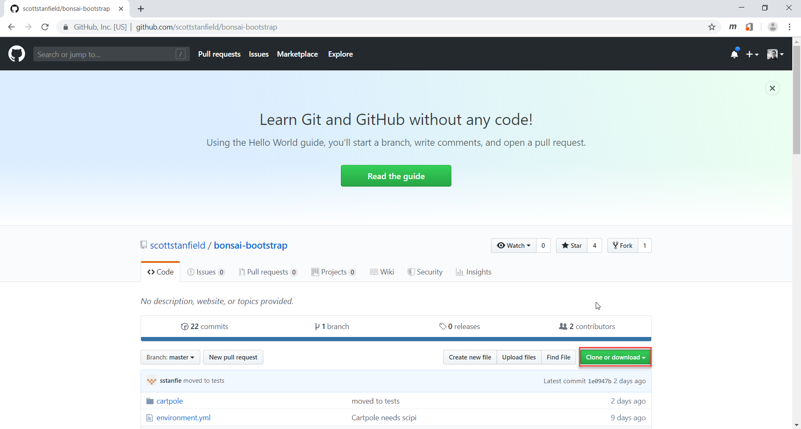
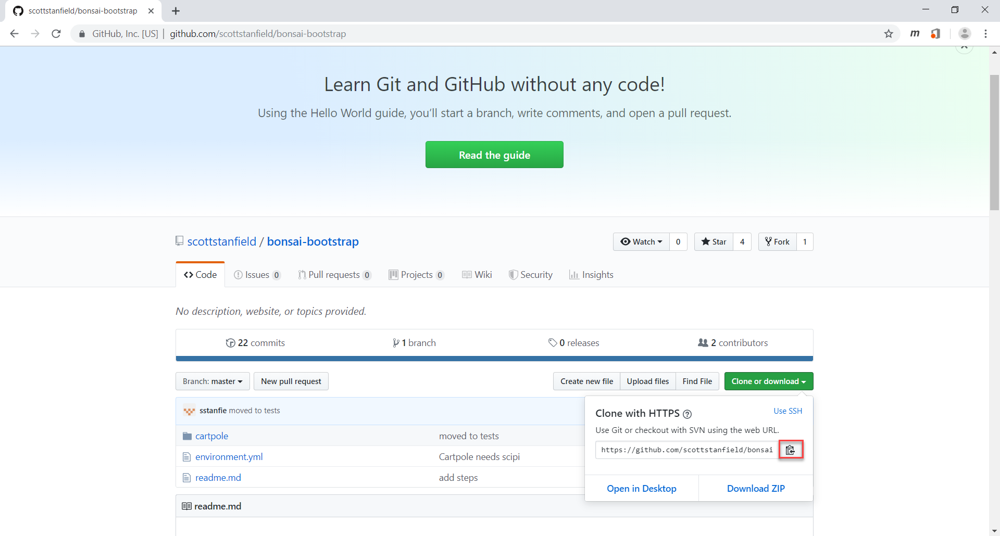
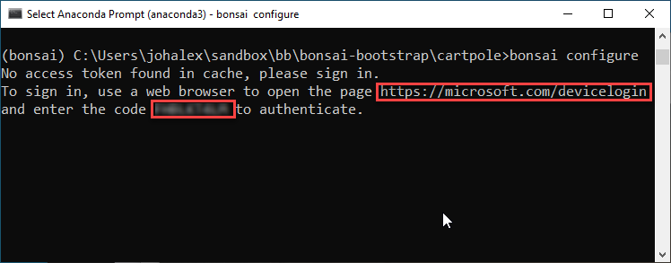
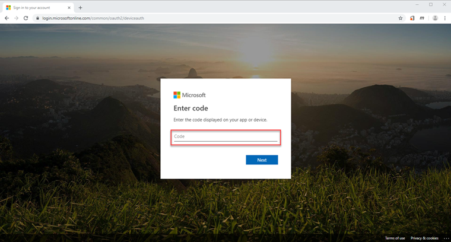
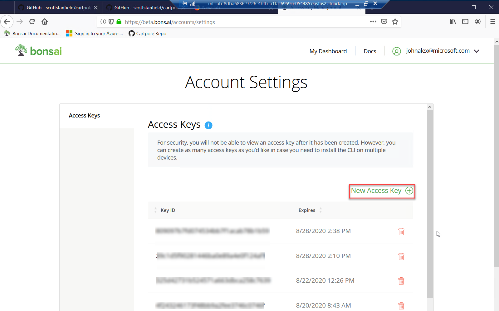
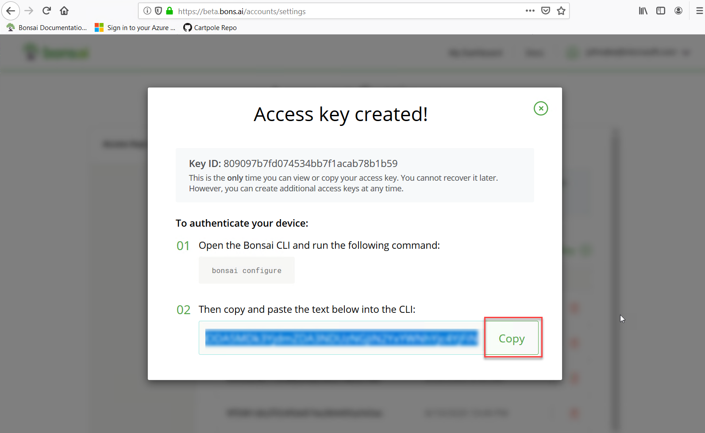
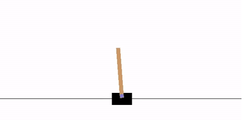
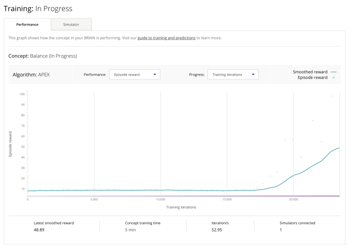

# Lab 01 - Getting started with machine teaching using Cartpole and Bonsai

In this lab, you'll be introduced to Machine teaching using Bonsai. You'll create a BRAIN to train the OpenAI Gym environment for Cartpole, a simple balance control problem.

## Setup

1. Login to the lab instance with the following username and password:

    * Username: bonsai
    * Password: #Bonsai2019!

## Clone the Cartpole GitHub repo

2. Open `Firefox` from your taskbar and navigate to the [cartpole lab repo](https://github.com/scottstanfield/cartpole).

3. On the GitHub repo page, click on the **Clone or download** button, as in the following illustration:
 
    

4. On the GitHub repo page, click on the **Copy to clipboard** button, as in the following illustration:
 
    

## Create and activate the environment

5. In the taskbar, click on **Anaconda Prompt (anaconda 3)** and clone the Cartpole GitHub repo with the following command:

    ```shell
    git clone https://github.com/scottstanfield/cartpole.git
    ```

6. In the Anaconda Prompt, create an environment with the following commands:

   * Change to the `cartpole` directory you just created with `git clone` with the following command:

    ```shell
    cd cartpole
    ```  

   * Run the following command to create the environment:

    ```shell
    conda env create -f environment.yml
    ```

   * Next, activate the environment with the following command:

    ```shell
    conda activate bonsai
    ```

### Configure Bonsai

7. Authenticate and configure Bonsai with the following command:

    ```shell
    bonsai configure
    ```

   * `bonsai configure` will request a device login with a code at [devicelogin](https://www.microsoft.com/devicelogin), as in the following illustration:

    

   * Authenticate with your Azure account on the AAD sign in, as in the following screenshot:

    

   * Sign into beta.bons.ai and create an access key, and paste it into the Anaconda prompt, as in the following illustrations:
 
    
 
   * Copy the access key and paste it into the Anaconda prompt, as in the following illustration:
 
    
 


### Verify bonsai configuration with bonsai diagnose

[bonsai diagnose](https://docs.bons.ai/references/cli-reference.html#bonsai-diagnose) runs several tests to ensure your local configuration is set up correctly. These tests are:

   * Version of the CLI, to check if it is up-to-date.
   * Status of http://beta.bons.ai
   * Local configuration

 * Run `bonsai diagnose` with the following command:

    ```shell
    bonsai diagnose
    ```

## Create the BRAIN and upload related files

8. Create your BRAIN (and its related project file) with `bonsai create` and give it a name using the following command:

    ```shell
    bonsai create cartpole1
    ```

    Use [bonsai push](https://docs.bons.ai/references/cli-reference.html#bonsai-push) to upload the `cartpole1` BRAIN and its associated files to the Bonsai AI Engine for training:

    ```shell
    bonsai push
    ```

## Train the BRAIN

9.  Use the [bonsai train start command](https://docs.bons.ai/references/cli-reference.html#bonsai-train-start) to enable the Bonsai AI Engine training mode to train the BRAIN:

    ```shell
    bonsai train start
    ```


## Connecting a simulator

Now that your BRAIN is ready to train, connect it to the sim.py file, and start the BRAIN training. Training doesn't start until the BRAIN is connected to a simulator.

10. Connect your BRAIN to the python simulator for OpenAI Gym (sim.py) with the following command:

    ```shell
    python sim.py --render
    ```

    The `--render` parameter displays the simulation's graphical rendering, as in the following illustration:

    
 
 


### Connect additional simulators to maximize training time

You'll connect additional simulators to train your BRAIN at a faster rate. You'll do this with a batch file.

   * Open a new instance of **Anaconda Prompt** from the taskbar (Right-Click, Open).

   * Change to the `cartpole` directory with the following command:

   ```shell
    cd cartpole
   ```  

   * Activate the the bonsai environment with the following command:

   ```shell
   conda activate bonsai
   ```

* Run the `launch_multiple_sims.bat` batch file to launch five more instances of sim.py with the following command:

   ```shell
   launch_multiple_sims.bat cartpole1
   ```

The five `sim.py` instances aren't graphically rendered to maximize speed.
 


## Monitor training

While the BRAIN is training, you can monitor the progress both locally and on the Bonsai website.  



This graph will display each of your concepts to be trained (if you look in the Inkling code you’ll see that Cartpole only has one).

Training Cartpole for about 15 minutes will enable reasonable performance for this particular task. The longer you train the BRAIN in this case, the longer the cart will be able to balance the pole before it falls over. You can experiment with training for longer but you should be able to see the reward start to flatten out after 10 minutes or so as shown in the picture. Your graphs will vary because the training takes random actions, so don’t worry if yours don’t look like these.

## Finish training

11. Once the BRAIN is trained, use `bonsai train stop` , with the following command:

    ```shell
    bonsai train stop
    ```

## Predict the cartpole

12. Now that you've trained your BRAIN, connect it again to the python simulator for OpenAI Gym (sim.py) with the following command:

    ```shell
    python sim.py --render -predict
    ```

Congratulations! You've successfully trained your BRAIN and used it for predictions.
